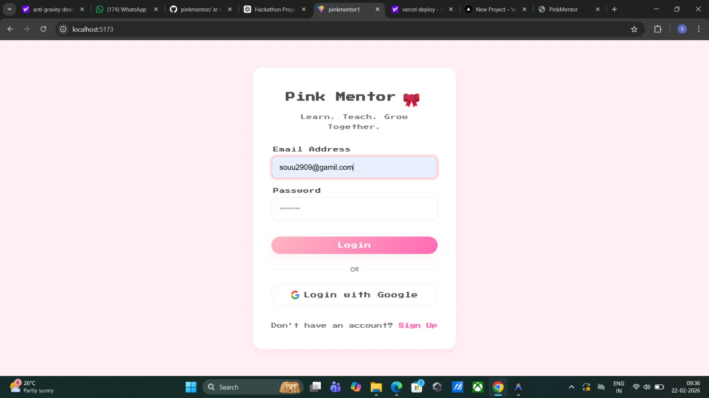
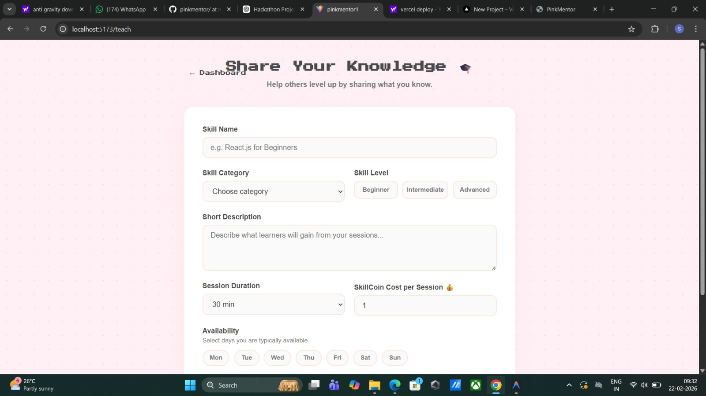
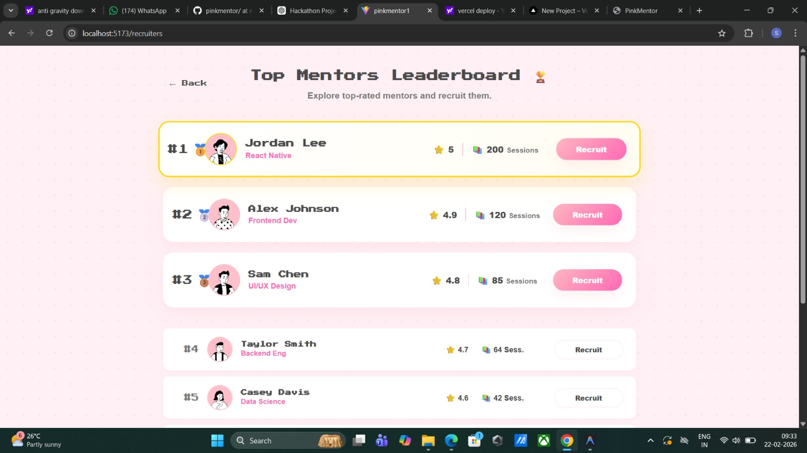

<p align="center">
  
</p>

# PinkMentor 🎯

## Basic Details

### Team Name: CodeVerse

### Team Members
- Member 1:Aysha Sulthana - TIST
- Member 2: Soumya R - TIST

### Hosted Project Link
[mention your project hosted link here]

### Project Description
PinkMentor is a mentorship platform designed to connect learners with experienced mentors for structured guidance, career growth, and skill development. The platform enables users to register, explore mentorship opportunities, track progress, and build meaningful learning relationships in an organized and scalable way.

### The Problem statement
Many students and early professionals struggle to find consistent and structured mentorship. Even when mentorship exists, it often lacks:

- Clear goal tracking  
- Progress monitoring  
- Organized session scheduling  
- Centralized communication  

As a result, mentorship becomes informal, inconsistent, and ineffective

### The Solution
PinkMentor provides:

- Role-based authentication (Mentor / Mentee)
- Structured goal creation and tracking
- Session scheduling system
- Dashboard with progress insights
- Centralized mentorship records

By combining these features, PinkMentor transforms mentorship into a trackable and organized growth system.

## Technical Details

### Technologies/Components Used

**For Software:**
- Languages used:JavaScript ,Python
- Frameworks used: React (Frontend), FastAPI (Backend)
- Libraries used: - Axios, React Router, Pydantic, SQLAlchemy
- Tools used: VS Code, Git & GitHub, Postman, Uvicorn

**For Hardware:**
- Main components: [List main components]
- Specifications: [Technical specifications]
- Tools required: [List tools needed]

---

## Features

List the key features of your project:
- User Authentication (Login / Register)
- Mentor & Mentee role selection
- Goal creation and progress tracking
- Session scheduling
- Dashboard with mentorship overview
- REST API based backend architecture
  
---

## Implementation

### For Software:

#### Installation
```bash
#Clone The Repository
git clone https://github.com/yourusername/pinkmentor.git

```

## Project Documentation

### For Software:

#### Screenshots 


Login and Registration Page
Secure sign-in page with email/password and Google authentication options.


View My Matches / My Sessions
Manage upcoming and past sessions, track learning progress, and join scheduled meetings.


Share Your Knowledge Page
Form to create a new skill offering with level, pricing, availability, and description.


Recruit Talent (Leaderboard)
Explore top-rated mentors based on reputation and session count and recruit the best fit.


---

## Project Demo

### Video
[Add your demo video link here - YouTube, Google Drive, etc.]

*Explain what the video demonstrates - key features, user flow, technical highlights*


---

## AI Tools Used

Tool Used: ChatGPT

Purpose:

- Code debugging

- Backend API structuring guidance

- Documentation drafting

Percentage of AI-generated code: ~20%

Human Contributions:

- Full architecture design

- UI development

- Backend implementation

- Integration & testing

---

## Team Contributions

- Soumya R: Frontend development, API integration, UI/UX design, documentation

- Aysha Sulthana: Backend development, database design, authentication system

---

## License

This project is licensed under the [LICENSE_NAME] License - see the [LICENSE](LICENSE) file for details.

**Common License Options:**
- MIT License (Permissive, widely used)
- Apache 2.0 (Permissive with patent grant)
- GPL v3 (Copyleft, requires derivative works to be open source)

---

Made with ❤️ at TinkerHub
